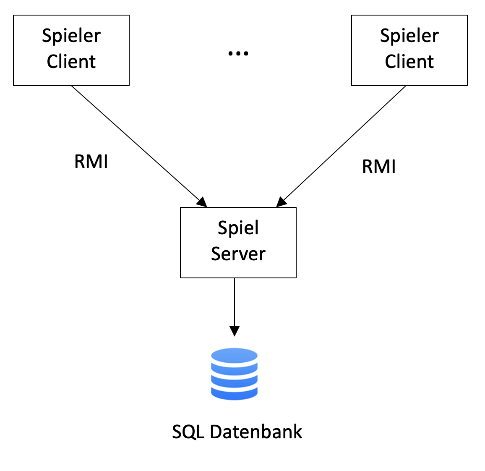

## Systemübersicht (Author:in)

> **Inhalt**: grober Überblick über die erwartete Systemarchitektur und Einordnung des Systems in die Systemlandschaft 
> des Kunden. Falls Schnittstellen zu Nachbarsystemen bestehen, dann müssen diese abgebildet werden. 

... In Arbeit

**Beschreibung**

Das Scrabble Spiel wird als eine Server-Client-Anwendung mit Datenbank umgesetzt. 
Die Scrabble-Spieler sind die Clients. Für die Kommunikation zwischen den Clients und dem Server wird Remote Methode Invocation (RMI) genutzt. 
Die Clients schicken dem Server Aktionen (Spielzüge), die sie gerne ausführen möchten. Der Server verarbeitet die Aktionen und schickt das Ergebnis an die Clients. Die Spielinforationen werden in einer SQL Datenbank gespeichert.